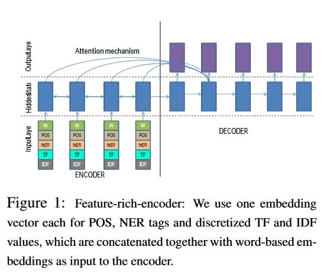

# Abstractive Text Summarization Using Sequence to Sequence RNNs and Beyond
- Proposing methods that address 
    - Modeling key words
    - Capturing the hierarchy of sentence-to-word structure
    - emitting words that are rare or unseen at training time

-  Abstractive -> Denote a summary is not a mere selection of a few existing passages or sentences extracted from the source, but a compressed paraphrasing of the main contents of the document, potentially using vocabulary unseen in the source document. 
- Abstractive summarization is a different problem from MT
    - Target summary is short
    - Doesn't depend on the length of the source document 
- Challenges
    - Optimally compress the original document in a lossy manner such that the key concepts in the original document are preserved (translation is loss-less)
        - Optimal compression inherently also requires better knowledge representation methods.

- Models
    - Encoder-Decode RNN with Attention and Large vocabulary trick
        - Uses 'Large Vocabulary Trick" -> Vocabulary of decoder restricted to most frequent words + words in the source document of a mini batch
    - Feature Rich Encoder -> To add more information about the words 
         
    - Switching Generator pointer -> handling OOV words
        - While training explicit pointer position provided
        - While testing, model decides automatically at each time step whether to generate or to point.
    - Capturing hierarchical document structure with hierarchical attention
        - RNNs capturing info at sentence and word level

- Achieved state of the art then (2016) in gigaword and DUC but since the datasets only consisted of single sentence summaries they created the CNN daily mail corpus.  
    - The model which performs best is the feats-lvt2k-2sent-ptr(which is all the above features in one model and the fact that it was trained on the first 2 sentences of the summary)
    - The model which performs better than the baseline as showcased is the words-lvt2k-1sent (which is word level features + LVT trick + training on the 1st sentence)

- CNN Daily Mail Corpus 
    - Observed that gigaword and DUC consist of only one sentence in each summary
    - Modified an existing corpus to create multi sentence summary corpus (first seen in this paper, hence became standard)
    - 150k source vocab and 60k target vocab, 800 tokens source, 100 tokens vocab 
    - 100 dimensional word2vec and 200 dimensional hidden state size.
    - The model which performs best is the words-lvt2k model, but the ptr and hieratt models suffer even though they performed better on the gigaword and DUC dataset.
