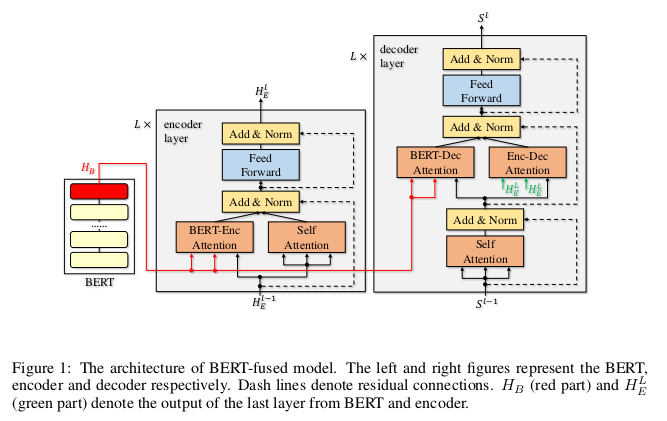

# Incorporating BERT into neural machine translation
- This paper explores the idea of using BERT as a contextual embedding approach for downstream language understanding tasks. They propose a new algorithm called BERT-fused model where in BERT is used to extract representations and then fed to an encoder decoder model with attention. 
- They experiment with using BERT and fine-tuning it and also using it as a context aware embedding model. The former doesnt result in significant gains. 
- The new BERT-fused model exploits the representation from BERT by feeding it into all layers rather than served as input embeddings only. 
- Preliminary explorations are shown below:

- The model architecture: 

- The BERT model is freezed while training and drop-net trick is used for enforcing the condition that all embeddings are used. 
