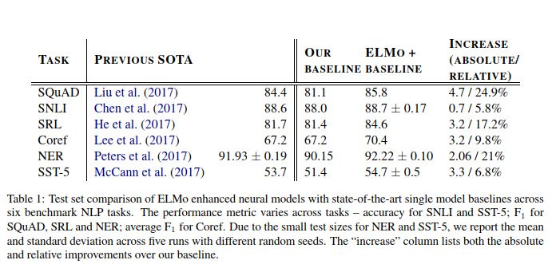

# Deep Contextualized Word Representations 
- This paper introduces a new type of word representations which models context and captures
    - Complex characteristics of word use (Syntax and semantics)
    - How these uses vary across linguistic contexts.
- The word vectors are learned functions of the internal states of a deep biLM, which is pretrained on a large text corpus.
    - Each token is assigned a representation that is a function of the entire input sentence. 
    - ELMO(embeddings from language models) representations are deep becauses they are a function of the internal layers of the biLM.
    - The higher level LSTM states capture context-dependent aspects of the word and the lower level LSTM states model aspects of syntax. 
- Deep representations outperform those derived from the top layer of the LSTM.
- ELMO embeddings are fucntions of entire input sentences ( Thus concluding that elmo gives out sentence representations).
- The final model uses L=2 biLSTM layered with 4096 units and 512 dimension projections and a residual connection from the first to second layer. The context insensitive type representation uses 2048 character n-gram conv filters, followed by 2 highway layers projecting down a 512 vec representation. The biLM provides three layers of representations for each input token. 
- It can be used in a pipeline wherein, the pretrained elmo gives representations to the downstream task and is further finetuned on domain specific data which could finetune the representaions for the downstream task. (Has been shown to improve performance for QA, SNLI etc.)

- ELMO is usually included at both the input and the output layer for SNLI and SQuad, while for SRL only the input layer was better. 
