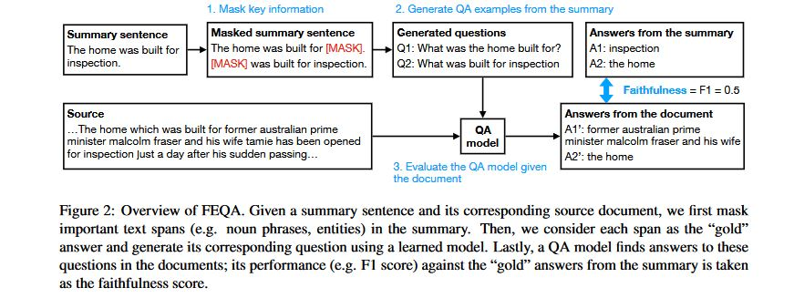

# FEQA: A Question Answering Evaluation Framework for Faithfulness Assessment in Abstractive Summarization
- Neural abstractive summarization models are prone to generate content inconsistent with the source document i.e unfaithful.
- This paper tackles the problem of evaluating faithfulness and also propose an automatic QA based metric.
- Findings
    - Current models are limited by a trade off between abstractiveness and faithfulness.
- Abstractiveness-Faithfulness tradeoff
    - Factual errors occur more frequently as models generate more abstractive summary sentences.
    - CNNDM is more extractive than XSUM
        - Extraction scores of the references summaries shows that half the sentences in CNNDM are formed by deleting words in one of the source sentences.
    - Models trained on CNN/DM are near extractive while models trained on XSUM are significantly more abstractive.
    - Additional inductive bias is needed to condense multiple sentences by rephrasing.
- FEQA 
    - The model correlated better with human judgment compared to other automatic metrics but is limited by the quality of the QA model.
    
- Findings
    - Entailment metric does not have a significant correlation with faithfulness.
    - Models might be good at copying important source content, but tend to concatenate unrelated spans and hallucinate details when generating abstractive sentences.
