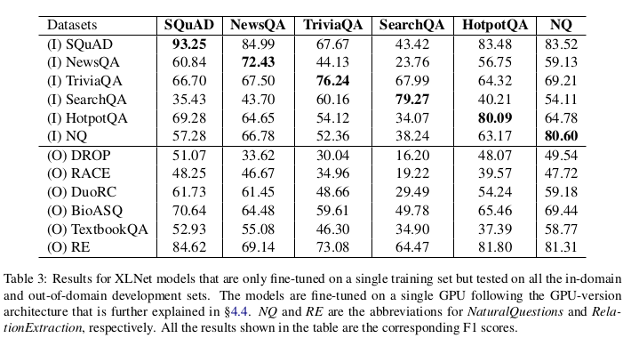
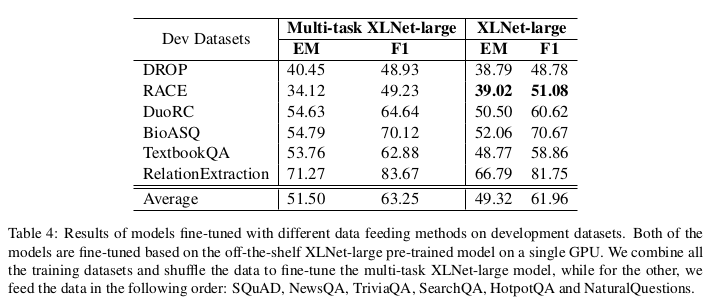
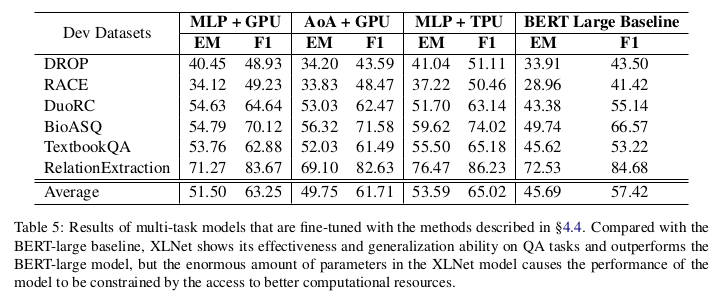

# Generalizing Question Answering System with Pre-trained Language Model Fine-tuning
- Although QA systems are improving, Most existing methods focus on specific datasets and not much is known as to how these methods generalize to out of domain and unseen RC tasks.
- The paper builds a model on top XLnet and then finetuned on multiple RC datasets.
- Finetuning the XLNET model is done by an additional MLP layer.
- The experiments are run on GPUs and TPUs. The results for Training on single dataset but testing on all other dataset are shown below:

- It is found empirically that the data feedings order when training has a great impact on performance. Two data feeding methods are suggested, multi-task learning and datasets shuffled separately one after the other. The results for the same are shown below.

- Results for Multi-task models are shown below, it can be inferred that GPUs are generally inferior to TPUs for training and can also be constraining in performance at times.

