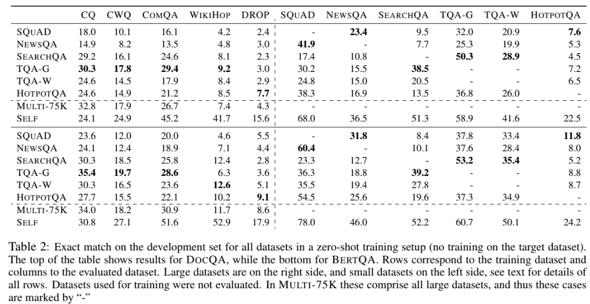

# MultiQA: An Empirical Investigation of Generalization and Transfer in Reading Comprehension
- A large number of QA datasets have been created recently, this paper aims to verify whether they help in generalization / if the parameters learned in one are transferable to another. 
- Training on multiple source RC datasets leads to Robust Generalization and transfer, Finally MULTI-QA is introduced a BERT-based model which leads to SOTA on five datasets. 
- Using BERT-large, one can train a single model on multiple RC datasets and obtain close to or better than SOTA performance on all of them without fine tuning on any particular dataset. 
- They also introduce infrastructure for easily performing experiments on multiple RC datasets. 
- Large datasets are said to have more than 75k examples and small have less than 75k. The large datasets used are SQuAD, NewsQA, SearchQA, TriviaQA, HotpotQA, while the small datasets are CQ, CWQ, WikiHop, ComQA, DROP.
- MultiQA dataset is 75k examples from each of the large datasets. Performance for generalization setup is shown below. 

- It is also shown that MultiQA dataset is good for Transfer learning and the performance is shown below. i.e you first train on the Multi-QA dataset and then finetune on target dataset. 

- MultiQA bert model is trained of 375k examples of each of the large datasets and achieves SOTA as well is good against adversarial QA examples. 
