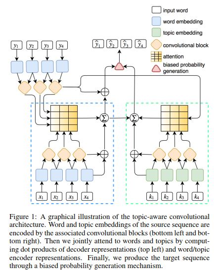

# A Reinforced Topic-Aware Convolutional Sequence-to-Sequence Model for Abstractive Text Summarization

## Summary
- This paper introduces Convolutional Sequence to sequence model and incorporate topic information while training this with Reinforcement Learning (The SCST method).
- The experiments are done on Gigaword, DUC2004 and LCSTS datasets.
- THe ConvS2S framework is jointly modeled with topic-aware attention mechanism. Topic Information is meant to provide themed and contextual alignment information. To avoid exposure bias, it is trained with RL which directly optimizes on ROUGE, which is metric on which summaries are evaluated on. The model is initially trained with MLE + RL objective.

- The convS2S architecture itself is a vanilla convolutional encoder-decoder module in which both the encoder and decoder have several convolutional layers stacked. The input to this are the embedded input sentences. Both the encoder and decoder have 6 convolutional layers each.
- A topic model is used for discovering abstract ideas or hidden semantic structures. The topic embeddings are found by LDA with Gibbs Sampling[Latent Dirichlet Allocation]. LDA is used during pretraining to assign topics to the input text.
- A joint attention mechanism is employed during decoding to incorporate both topic level and document level attentions. The probability distribution generation is biased towards topic information.

## Strengths
- This paper shows that the incorporation of topic level information can enhance content selection and summary generation in summarization.

## Weaknesses / Doubts
- How well would the model perform when it is given document level information, and the model is currently only trained on shorter texts of data and short summaries given the dataset choice. What if this model is trained on CNN/Daily Mail or Newsroom?
- The reinforcement learning objective just offers slight improvements.
