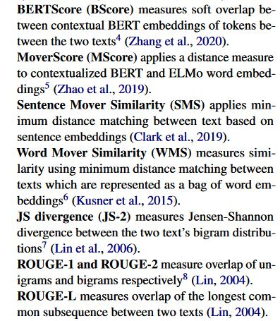

# Re-evaluating Evaluation in Text Summarization
- ROUGE has been the de-facto standard of automatic evaluation in summarization for 20 years.
- This paper is a meta-evaluation paper commenting on the reliability of automatic metrics, using top-scoring system outputs, b o   th extractive and abstractive models on recent popular datasets (TAC 2008,2009, CNN/Dailymail).
- Two meta-evaluation strategies adopted: 
    - Summary level
    - System level
- Method of collecting human judgements -> Generate summaries, select samples from test set based on some criteria of difficulty, Evaluate summaries for selected test set samples.
    - About 25 top-scoring, extractive, abstractive and extract-abstract models are considered. 
    - Metrics considered include (all recall based versions are used)
    
    - For manual evaluation, LitePyramid method is used which presents SCUs (Semantic content units) that can be referenced from the ground truth summary to the user with the system summary for the sample, then the model is score dependent on the number of SCUs that can be inferred.
- Findings
    - Many attested properties of metrics on TAC dataset demonstrate different trends of CNN/DailyMail. 
        - For example, Moverscore being a better performance metric on TAC but much worse than Rouge 2 on CNN/Dailymail.
        - R-2 is the best metric to compare systems when it comes to CNN daily mail.
    - Most metrics are better at comparing summaries than systems on CNNDM.
- Takeaways and future suggestions
    - There is no one-size-fits all metric that can outperform others on all datasets, suggests utility of using different metrics for different datasets to evaluate systems.
    - Metrics cannot reliably quantify the improvements made by one system over others, especially for the top few systems across all datasets.
    - Meta-evaluation done for metrics on old datasets does not hold for newer datasets. Therefore multi-dataset multi-metric evaluation can help us understand each metrics peculiarity.
        - because metrics can overfit on limited datasets
    - This metric can be used to learn a robust metric for text summarization, using BLEURT (Sellam et al 2020).
