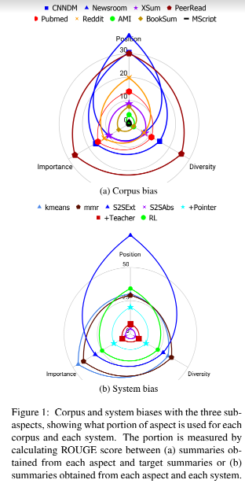
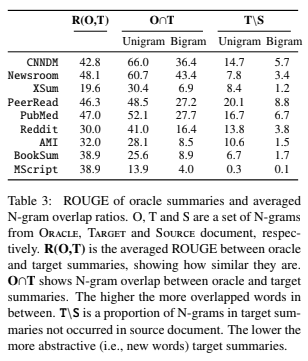
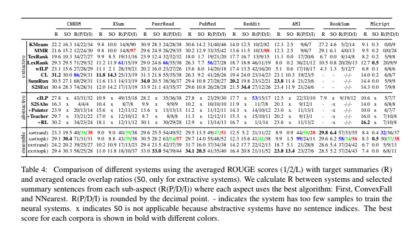

# Earlier Isn’t Always Better: Sub-aspect Analysis on Corpus and System Biases in Summarization
- Position of sentences in the original sentences is a well known bias for news summarization.
- The paper considers 3 sub-aspects of summarization:
    - position: choosing sentences by their position
    - importance: choosing relevant content 
    - diversity: ensuring minimal redundancy between summary sentences
- They also conduct an extensive analysis of the biases of each sub-aspect wrt to 9 different summarization corpora and therefore a notion of "corpora-bias" is established as shown in the figure below.

- It's found that except XSUM, summarization of personal and news articles is biased towards position while academic articles are well balanced. Summarizing long documents is a fundamentally difficult task which requires the usage of these multiple aspects. 
- A notion of the 3 subaspects is built formally using a BERT sentence encoder:
    - For position, k sentences are chosen from three sections which are the First, last and middle parts of the document. 
    - For diversity, three notions are built. 
        - Default: The Yogatama et al 2015 paper chooses extractive summary sentences that maximize the semantic volume in a distributed semantic space, the objective here is to find a search function which maximizes this volume.
        - Heuristic: Choosing set of summary sentences using a greedy algo.
        - ConvexFall: refer to paper. 
    - For importance, N-nearest and K-nearest are used.
- The evaluation metrics used are Rouge, Volume Overlap Ratio and Sentence overlap ratio.
- The summarization datasets used are CNNDM, Newsroom, Xsum, PeerRead, PubMed, Mscript, BookSum, Reddit, AMI.
- The analysis on Corpus Bias reveals the following:
    - Earlier isnt always better. Although news articles might have this bias, other datasets have a wider context while movies are biased towards the end.
    - Xsum requires a very strong importance of notion to do well on the task. 
    - ConvexFall and N-nearest tend to work better than the other algos for each aspect. 
    - Social posts and news articles are biased towards position and the other aspects are less important. 
    - Paper Summarization is a well balanced task. (Peer read and PubMed)
    - Conversational, movie and book summarization are challenging tasks. 
    - Importance and diversity are less overlapped and hence should be considered together, because separately they might have opposite results. 
    - Analysis of words not found in source doc is as shown in the figure below. 
    
- The analysis of system bias, Check the figure below.

