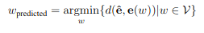
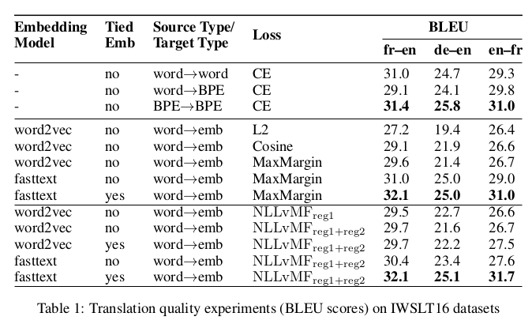
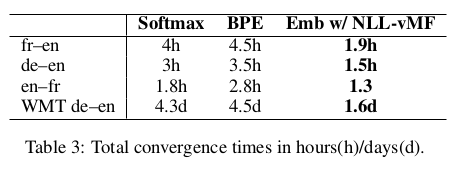
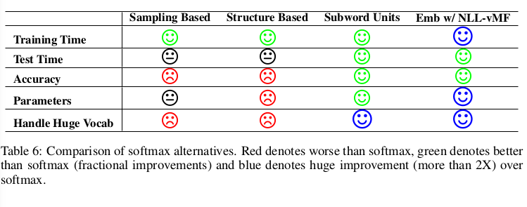

# Von Mises-Fisher Loss for training Seq2Seq Models with Continous Outputs
## Keypoints
- The paper inherently tries to tackle the issue of using the sigmoid layer as the output layer in Seq2Seq Models. Seq2Seq Models usually use the sigmoid layer and predict a multionomial distribution over the vocabulary.
- The problem lies in the size of the vocabulary, usually only the top 20-30 thousand frequent words are used and the rest are called `<UNK>` i.e unknown, this interferes with the models ability to take into account rare words or build up additional context and is important for tasks where in text generation is a part of the pipeline.
- The paper introduces a novel probabilistic loss, and a training and inference procedure with which a probability distribution is generated over the low-dimensional pretrained word embeddings.
- The model is trained with continous outputs by minimizing the distance between the output vector and the pretrained word embedding of the reference word.
- At test time, the model generates a vector and searches for its nearest neighbor in the target embedding space to generate the corresponding word.
- One important thing to note is although the ability to predict a word embedding should make model powerful due to its ability to choose over the entire embedding space, its performance lacks compared to regression losses like l2 loss because l2 loss assumes a gaussian distribution of the output space which is false for embeddings which are sparse and distributed(not-neccessarily uniform) across the space.
- Therefore the probability distribution needs to be modeled conditioned on the input. So, a new loss function based on defining probability distribution over the word embedding space and minimizing its Negative log likelihood is also proposed.
- Subword Based Methods make the model truly open vocabulary and was the earlier solution to the vocabulary problem, it is the current SOTA for Machine Translation and is used as the baseline in the paper. (BPE Encoding)
- The formalisation of the generation step is as follows, the models produces e_^ and the ouput word is predicted by searching for the nearest neighbor of e_^ in the embedding space, but while training since both are known the distance is just minimized.

- A Novel probabilistic loss function is introduced, to estimate directional distribution von mises-Fisher defined over a hyperspher of unit norm is used.
- A regularization term is added, since the current formalization decreases the second term rapidly.
- A variety of experiments are done involving, tying embeddings, using word2vec/fasttext and training times are noted.

## Future work
- Experiment with contextual embeddings, although learnt in a completely different fashion, it might also make us interpret the behaviour of these words.
- The paper mentions two follow-ups:
  - Integrating a pre-trained LM to reduce ungrammatical outputs.
  - Using syntactically inspired embeddings like (Levy & goldberg 2014, Ling et al 2015) to reduce syntatic errors.
- Exploring Additional Loss Functions.
- Introducing Beam search to continual Outputs.
- Using Scheduled Sampling etc.
- Most of the follow up work has to definitely experiment with different types of embeddings.
- Use of this function in RL-NLP will help and can help GAN based NLP as well.

