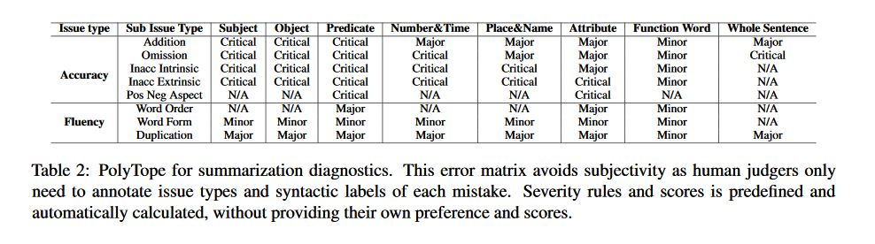
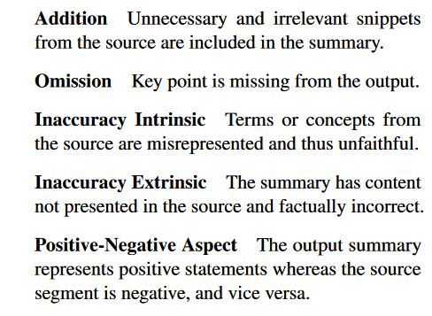
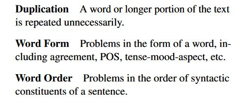
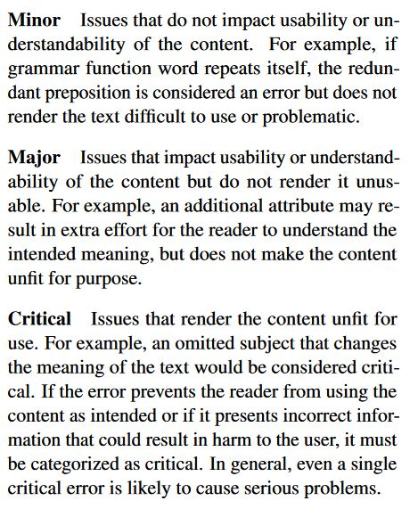

# What have we achieved on Text Summarization
- The paper appeared in EMNLP 2020, and tries to look at the gap between automatic summarizers and human level summarizers.  
- The contributions of the paper include quantifying sources of error and some empirical findings on the respective models that are tested.
- Findings
    - Traditional methods are still strong baselines vs neural archs.
    - Extractive better than abstractive in similar settings. 
        - Extractive models suffer from unnecessity
        - Abstractive models suffer from intrinsic hallucination and omission
    - Copy and coverage work generally for the intended purpose but copy causes redundancy to a certain degree wile coverage has issues in faithful content generation. 
        - Extractive-abstractive approaches reflect relative strengths and weaknesses of the two methods.
    - Pretraining works better and achieves state of the art in both automatic and human evaluations.

- Polytope is based on Multidimensional quality metric and is an error oriented fine grained evaluation method focused on fluency and accuracy aspects. Quantifying 8 sources of errors in a mixture of 10 abstractive/extractive summarization models
    - Accuracy related issue (extent to which target is not faithful or factual wrt source text) sub types comprise of 
    
    -  Fluency (linguistic qualities of the target) related issues include:
    
    - Each error can be classified into a category of severity(this indicates how bad a particular error is)
    
- Interesting empirical findings
    - Neural extractive methods seem to pick sentences mostly from the beginning, thereby could miss useful information towards the end (probably a function of the dataset not the model). While statistical methods pick most from the earlier sentences and have a smooth curve towards the later sentences.
    - Copy mechanism helps word level redundancy, doesnt do anything for sentence level redundancy and introduces additional content 
    - Coverage is useful for content selection, but its found that it lacks inference capability and tends to generate summaries that incorrectly combine contents. 

## Strengths
- Polytope offers more fine grained information in quality evaluation
- It has some important empirical findings in case of not only what mechanisms work but what errors they introduce into the system

## Weaknesses
- The study could have been done on some other dataset, because research has shown that CNN daily mail has a leading bias, and some of the errors shown in the paper could have been eliminated or not present due to the consideration of another dataset.
    - For example, the conclusion of statistical proving a strong benchmark. LEAD-3 is better in the case of CNN/daily mail because news articles have a bias of having summaries in the earlier sentences and this helps the cause. 
- Consideration of wrong hybrid model/ no consideration of reinforcement learning models
    - RL models have contributed to the growth of the field substantially and have had alternative ways of handling issues for example Chen el 2018 and Pasunuru et al 2017. 
    