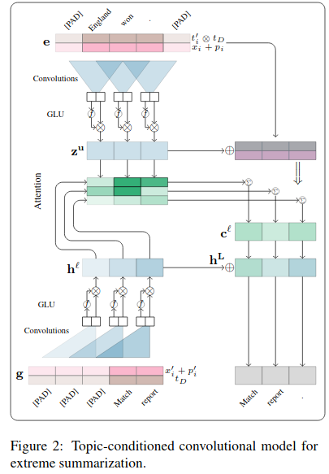
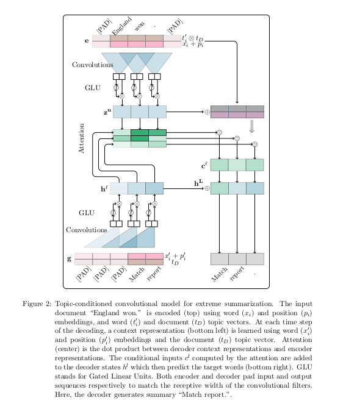

# Extreme Summarization with Topic-Aware Convolutional Neural Networks
## Summary
- This paper introduces the Extreme Summarization Task, which is the task of creating short, one-sentence news summary answering the question "What is the article about".
- A novel abstractive model based on CNNs is introduced. The CNN encoder associates each word with a topic vector i.e whether the word is representative of the document's content, the CNN decoder conditions each word prediction on a document topic vector i.e if the predicted word is in the theme of the document.
- The XSum dataset has BBC articles and one sentence summaries (introductory sentences which preface the article). The dataset has 227k articles.
<!--  -->

- CNNs are used because they can be stacked to represent larger context sizes, and hierarchical features can be extracted over larger and larger contents, allowing to represent long range dependencies efficiently through shorter paths.
- The model performs best on the XSUM and comparable performance to the best models in Newsroom-Abs.
